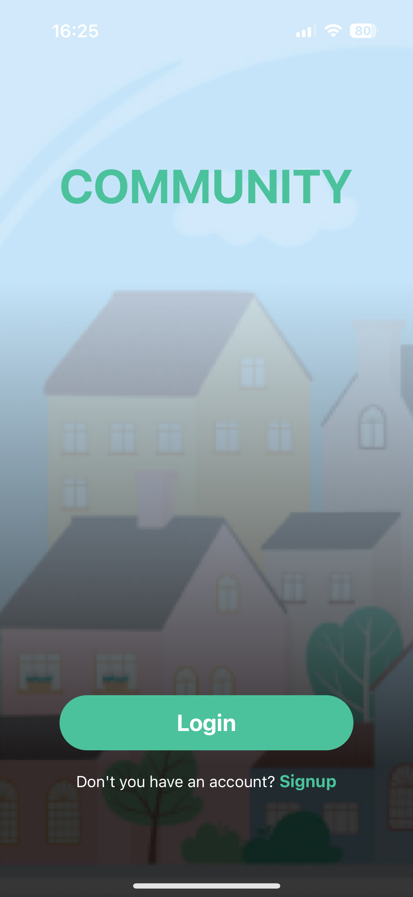
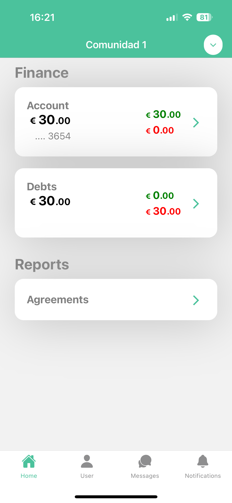
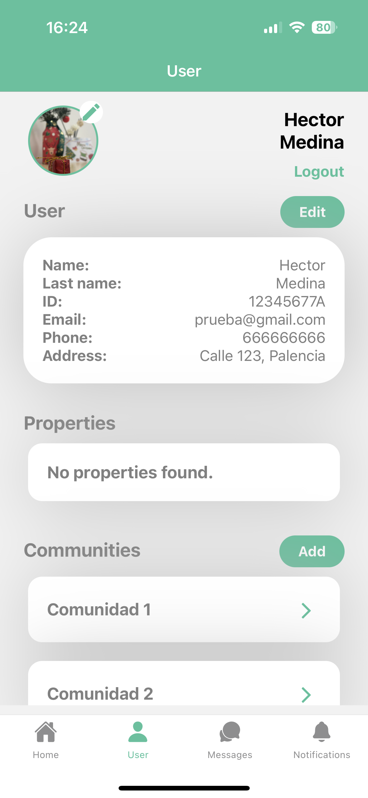
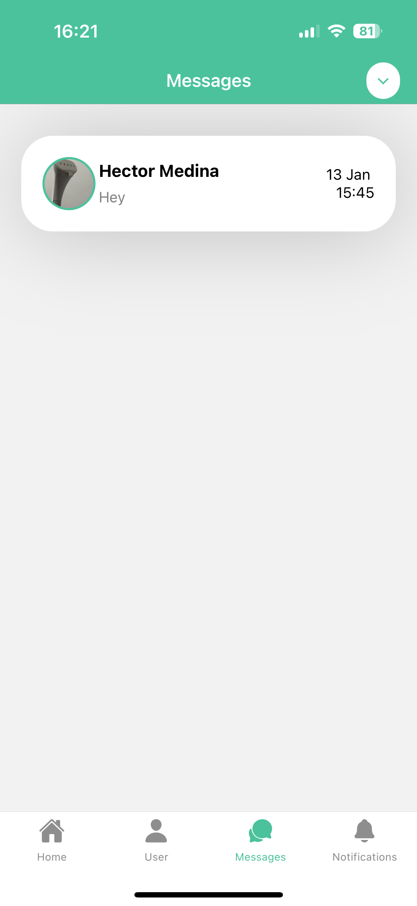
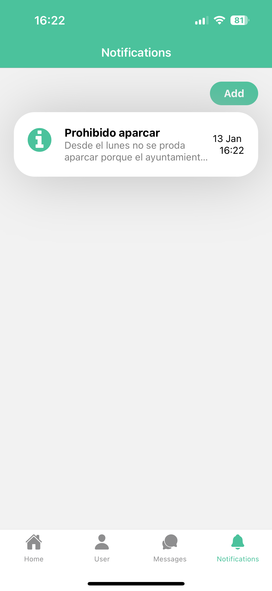

# Community
[![LinkedIn][linkedin-shield]][linkedin-url]

Este repositorio contiene el desarrollo del TFG (Trabajo Final de Grado) de los estudios de Grado en Ingeniería Informática impartido en la Universitat Oberta de Catalunya (UOC).

Community es una aplicación multiplataforma desarrollada en `React Native` con un backend basado en `Django Rest Framework`.

## Tabla de contenido

<ol>
  <li>Demo</li>
  <li>Entorno de desarrollo</a</li>
  <li>Uso</li>
  <li>Licencia</li>
  <li>Contacto</li>
</ol>

<!-- ABOUT THE PROJECT -->
## Demo
<p style = 'text-align:center;'>
  
  
  
  
  
</p>

Para acceder al demo se requiere un terminal móvil y tener instalada la aplicación `Expo Go`. 

### Versión iOS

Accede a `exp://u.expo.dev/update/c1665fa1-e223-480d-a297-46ceb450bf67` o escanea el siguiente código.

<p style = 'text-align:center;'>
  
</p>

### Versión Android

Accede a `exp://u.expo.dev/update/139b0251-5f02-480e-afbe-1d1234ce3e76` o escanea el siguiente código.

<p style = 'text-align:center;'>
  
</p>

## Entorno de desarrollo

### Dependencias.

Para poder utilizar el entorno de desarrollo se necesitará de lo siguiente:

- Docker version 24.0.2 o compatible.
- Docker Compose version v2.19.1 o compatible.
- npm version 9.8.1 o compatible.
- Aplicación `Expo Go` en un dispositivo móvil.

### Instalación.

Se deberán seguir los siguientes pasos:

#### Clonar el repositorio.

````
git clone https://github.com/hector-medina/tfg-multi.git
````

#### Descargar dependencias.

En el directorio del proyecto `/frontend/app`:

````
npm install
````

#### Desplegar backend.

En el directorio del proyecto `/backend`

````
docker compose up
````

#### Desplegar frontend.

Debemos indicar la IP del backend que utilizará el frontend con los datos de nuestra máquina. Para ello debemos modificar el fichero `/frontend/app/app.json`, cambiando el valor de la variable `API_URL`:

````
    "extra": {
      "API_URL": "http://192.168.100.17"
    }
````

En el directorio del proyecto `/frontend/app`

````
npx expo start
````

## Uso.

### Backend

Una vez se tiene el contenedor docker funcionando, podemos ver los logs en la terminal del sistema y tener acceso a un servidor de desarrollo de Django Rest Framework al acceder a [http://localhost](http://localhost). 

Si se accede con el navegador nos encontraremos con una lista de los endpoint creados y además se podrán crear registros en la base de datos, así como actualizarlos y listarlos. Si se quiere entrar como administrador, se deberá crear un usuario admin:

````
docker exec -it <ID_CONTENEDOR> bash
cd app
python manage.py createsuperuser
````

### Frontend

Para la parte frontend deberemos escanear el código QR que aparece en la terminal una vez ejecutamos el comando `npx expo start`.

Es importante destacar que el servidor de desarrollo debe ser alcanzable por red, es decir que el dispositivo móvil deberá encontrarse en la red LAN idealmente.

## Licencia

Esta obra está sujeta a una licencia de Reconocimiento-NoComercial-SinObraDerivada. [by-nc-nd cc](https://creativecommons.org/licenses/by-nc-nd/3.0/es/)

## Contacto

Hector Mario Medina Cabanelas

Linkedin: [https://www.linkedin.com/in/hector-medina-cabanelas/](https://www.linkedin.com/in/hector-medina-cabanelas/)

Email: hector.medina.cabanelas@gmail.com

[linkedin-shield]: https://img.shields.io/badge/-LinkedIn-black.svg?style=for-the-badge&logo=linkedin&colorB=555
[linkedin-url]: https://www.linkedin.com/in/hector-medina-cabanelas/
